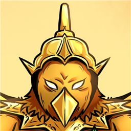

<h1>Guardian Alam Raya: Utusan Dewata Abadi</h1>

<em>An action RPG powered by Teachable Machine (TM).</em>

---

## Play as the knights of GARUDA
From the shadows of legend, ancient beings rise to cast dread upon the land. Garuda, witnessing the darkness unfold, descends from the skies bestowing divine fragments of his power upon chosen sools, the Knights of GARUDA, to banish all evil from the land once more.

<h2>Play Now</h2>

or click this <a href="garuda-kotak.vercel.app" target="_blank">link</a>

<!-- 

    <h1 style="margin-right: 20px;">Play Now:</h1>
    

 -->

## Features
- 100% hand-drawn, no borrowed or AI generated image assets.
- Responsive, interchangable TM model.
- No installation required: since the game is web based, it's hosted on vercel. (mobile compatibility coming soon)
- Locally stored progress via cookies.

## Minimum Requirements
- The minimum requirements recommended to play this game smoothly (requires further testing):
    - GTX 1050
    - AMD Radeon RX 560
    - Snapdragon 7s

## Playing Instructions
1. This game runs as a web application, so all you need is a browser.
1. Wi-fi connection is recommended to download and preload the resources.
1. Make sure your upper half torso is visible to the camera.
1. It's recommended to play in a well-lit environment to ensure the camera can detect your movements accurately.
1. When prompted, make sure to enable camera (or manually enabling it in site setting).

Detailed Overview

<em>tutorial example (will always appear when playing the game)</em>

<ol>
    <li>Title Screen</li>
        <ul>
            <li>press anywhere on the title screen to start the game</li>
            <li>"X" button: quit game</li>
            <li>Book button: open the encyclopedia</li>
            <li>Credits button: go to the credits page</li>
        </ul>
    <li>Character Selection Page</li>
        <ul>
            <li>after prologue, player can choose a "power crystal" each with different advantages</li>
            <li>players</li>
        </ul>
    <li>Playing the game</li>
        <ul>
            <li>new crystals are unlocked as you progress through and complete stages</li>
            <li>after completing through the story mode for the first time, you'll unlock survival mode</li>
            <li>battle endless enemies in survival mode</li>
            <li>progressing through also unlocks new entries for the encyclopedia</li>
            <li>secrets?</li>
        </ul>
</ol>

---

## Dev Team Overview

<h3>Developer: - Gilbert De Foucauld Winardy (Gibekkk) - Aryo Karel Merentek (Oreo-1)</h3>

<h3>Illustrator: - Felicia Suyanto</h3>

proyek ini dibuat untuk lomba game berbasis AI (TM) Technofest2025 UBM

made with ❤️ from the GaruDev team

